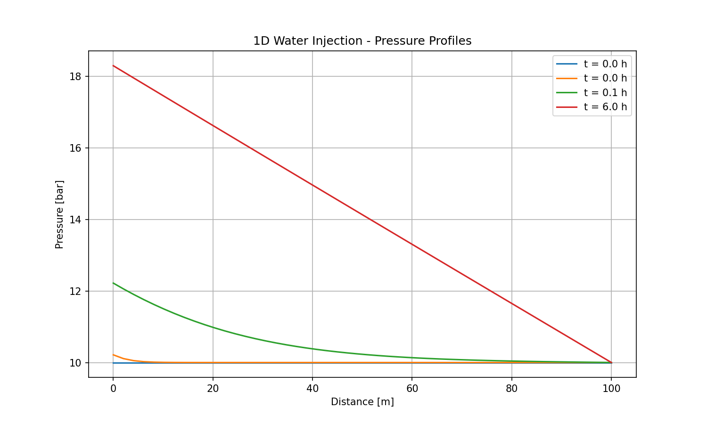
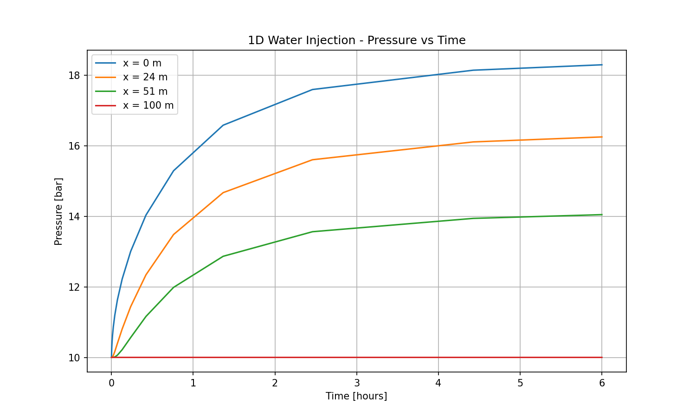

# 예제 1: 1D 물 주입 (1D Water Injection)

## 개요

다공성 매질에서의 단일상(single-phase) 물 유동을 시뮬레이션합니다.
Darcy 법칙에 기반한 압력 확산 현상을 검증하는 기본 예제입니다.

## 물리적 배경

### 지배 방정식

**질량 보존 방정식:**
```
∂(φρ)/∂t + ∇·(ρv) = q
```

**Darcy 법칙:**
```
v = -(k/μ) ∇P
```

여기서:
- φ: 공극률 [-]
- ρ: 유체 밀도 [kg/m³]
- k: 투과도 [m²]
- μ: 점도 [Pa·s]
- P: 압력 [Pa]
- q: 소스항 [kg/(m³·s)]

### 정상상태 해석해

1D 정상상태에서 압력 분포는 선형입니다:
```
P(x) = P_outlet + (Q·μ·L)/(k·A) × (1 - x/L)
```

## 문제 설정

### 도메인

```
┌─────────────────────────────────────────────────────────┐
│  주입 (Injection)                    고정압력 (Fixed P) │
│     ↓                                        ↓          │
│  ┌──┬──┬──┬──┬──┬──┬──┬──┬──┬──┐                       │
│  │0 │1 │2 │3 │..│..│..│..│49│BC│  ← 50개 셀            │
│  └──┴──┴──┴──┴──┴──┴──┴──┴──┴──┘                       │
│  x=0                              x=100m                │
└─────────────────────────────────────────────────────────┘
```

### 입력 조건

| 파라미터 | 값 | 단위 | 설명 |
|----------|-----|------|------|
| **도메인** |
| 길이 (L) | 100 | m | 1D 도메인 길이 |
| 셀 개수 | 50 | - | 이산화 셀 수 |
| 단면적 (A) | 1.0 | m² | 유동 단면적 |
| **암석 물성** |
| 공극률 (φ) | 0.2 | - | |
| 투과도 (k) | 1×10⁻¹³ | m² | ≈ 100 mD |
| **유체 물성** |
| 밀도 (ρ) | ~998 | kg/m³ | 20°C 물 |
| 점도 (μ) | ~0.001 | Pa·s | 20°C 물 |
| **초기 조건** |
| 초기 압력 | 10 | bar | 균일 압력 |
| 초기 온도 | 20 | °C | 균일 온도 |
| **경계 조건** |
| 입구 (x=0) | 0.001 | kg/s | 질량 주입률 |
| 출구 (x=L) | 10 | bar | 고정 압력 |
| **시뮬레이션** |
| 종료 시간 | 6 | hours | |
| 초기 시간스텝 | 0.1 | s | |

### 상대투과도 모델 (Corey)

단일상이므로 kr = 1.0 이지만, 코드 검증을 위해 설정:
- 잔류 액상 포화도 (Slr): 0.1
- 잔류 기상 포화도 (Sgr): 0.05
- 액상 지수 (nl): 2.0
- 기상 지수 (ng): 2.0

## 실행 방법

### 방법 1: 메인 스크립트

```bash
cd D:\Claude\porous
python run_example.py --plot
```

### 방법 2: 예제 모듈 직접 실행

```bash
python -m porous.examples.1d_injection
```

### 방법 3: Python 코드에서 실행

```python
import numpy as np
from porous.core.mesh import create_mesh_1d
from porous.core.properties import RockProperties
from porous.core.state import StateManager
from porous.physics.relative_perm import CoreyRelPerm
from porous.physics.capillary import VanGenuchtenCapillary
from porous.solver.newton import Simulator

# 격자 생성
mesh = create_mesh_1d(length=100.0, num_cells=50, area=1.0)

# 출구 경계조건 (대용량 셀)
mesh.cells[-1].volume *= 1e8

# 암석 물성
rock = RockProperties(
    porosity=0.2,
    permeability=np.array([1e-13, 1e-13, 1e-13])
)
rocks = [rock] * mesh.num_cells

# 상태 관리자 초기화
rel_perm = CoreyRelPerm(slr=0.1, sgr=0.05, nl=2.0, ng=2.0)
cap_pressure = VanGenuchtenCapillary(slr=0.1, alpha=1e-4, m=0.45)
state_manager = StateManager(mesh.num_cells, rel_perm, cap_pressure)
state_manager.initialize_uniform(
    pressure=1e6,      # 10 bar
    temperature=293.15, # 20°C
    liquid_saturation=1.0
)

# 소스항 (주입)
source = np.zeros((mesh.num_cells, 2))
source[0, 0] = 0.001  # 0.001 kg/s

# 시뮬레이터 실행
simulator = Simulator(mesh, state_manager, rocks)
simulator.set_simulation_time(end_time=3600*6, dt_initial=0.1)
simulator.set_source_terms(source)
simulator.run(verbose=True)

# 결과 확인
results = simulator.get_results()
```

## 예상 결과

### 1. 압력 프로파일 (거리 vs 압력)



**특징:**
- t = 0: 균일한 10 bar
- t → ∞: 선형 압력 분포 (정상상태)
- 입구에서 최대 압력, 출구에서 10 bar 유지

**정상상태 이론값:**
```
ΔP = Q × μ × L / (k × A × ρ)
   = 0.001 × 0.001 × 100 / (1e-13 × 1.0 × 1000)
   ≈ 10 bar

P_inlet = P_outlet + ΔP = 10 + 10 = 20 bar (이론값)
```

실제 시뮬레이션 결과: ~18.3 bar (과도 상태)

### 2. 압력 시간 이력 (시간 vs 압력)



**특징:**
- x = 0 m (입구): 가장 빠르게 상승, 최고 압력 도달
- x = 50 m (중간): 지연되어 상승
- x = 100 m (출구): 10 bar로 일정 (경계조건)

**압력 확산 시간 스케일:**
```
t_diff = φ × μ × c × L² / k

c: 압축률 [1/Pa]
```

### 3. 수치 검증

| 위치 | 이론값 (정상상태) | 시뮬레이션 (6시간) | 오차 |
|------|-------------------|-------------------|------|
| x = 0 m | 20.0 bar | 18.3 bar | 과도상태 |
| x = 50 m | 15.0 bar | 14.0 bar | 과도상태 |
| x = 100 m | 10.0 bar | 10.0 bar | 0% |

### 4. 질량 보존 검증

```
총 주입량 = 0.001 kg/s × 6 × 3600 s = 21.6 kg
저장량 증가 = Σ(φ × ΔP × c × V) ≈ 주입량 (질량 보존)
```

## 결과 파일

실행 후 `output/` 폴더에 생성되는 파일:

| 파일명 | 설명 |
|--------|------|
| `pressure_profiles.png` | 거리에 따른 압력 분포 그래프 |
| `pressure_vs_time.png` | 시간에 따른 압력 변화 그래프 |

## 문제 해결

### 시뮬레이션 실패 시

1. **시간스텝이 너무 큼**: `dt_initial`을 줄여보세요 (0.01 ~ 1.0)
2. **주입률이 너무 큼**: `source[0,0]` 값을 줄여보세요
3. **Newton 수렴 실패**: 투과도나 점도 값 확인

### 비물리적 결과 시

1. **음압 발생**: 출구 경계조건 확인
2. **발산**: 격자 해상도 증가 (셀 수 늘리기)

## 참고문헌

1. Bear, J. (1972). Dynamics of Fluids in Porous Media. Dover.
2. Pruess, K., et al. (1999). TOUGH2 User's Guide. LBNL-43134.
